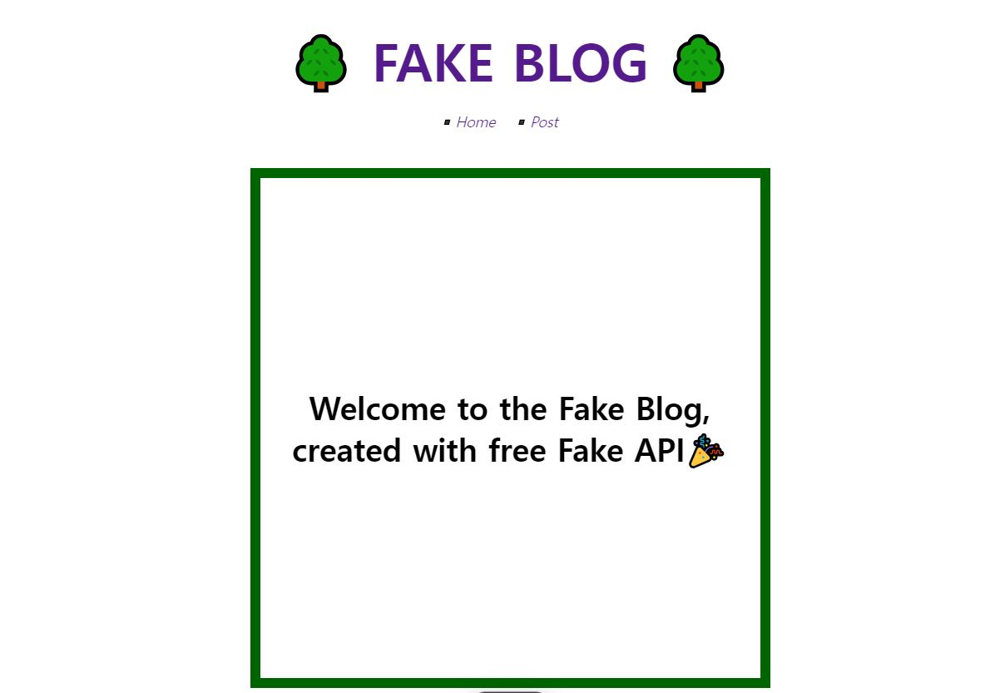
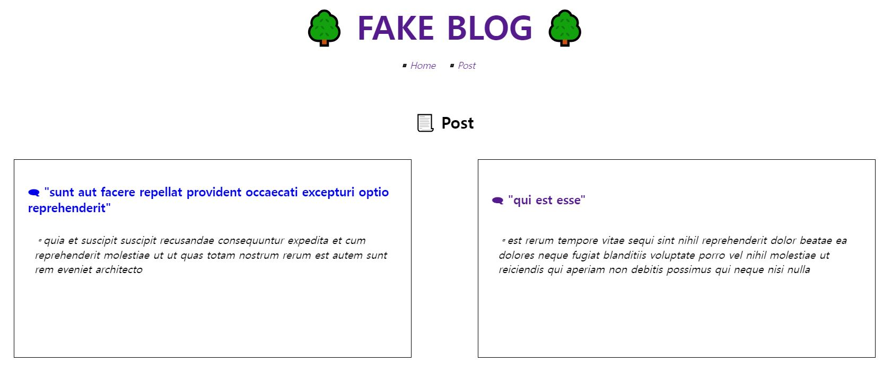
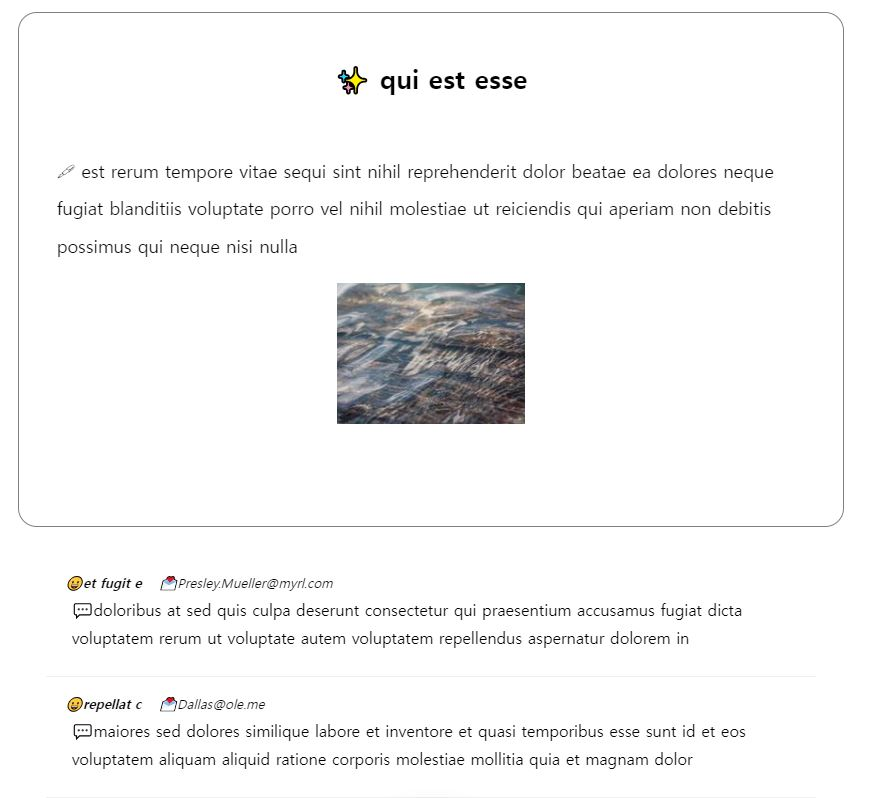

<div align="center">
<h1> Free API 이용해서 블로그앱 📑만들기</h1>

<p> 무료 API를 활용하여 만들어보는 나만의 Blog !   

 API에서 제공하는 가짜 데이터를 다양하게 활용하여 블로그에 필요한 Post, 댓글, 아이디를 만들고 기본 블로그를 완성하였습니다. </p>
<hr>
</div>

 ### 🚀 [블로그앱 보러가기](https://blog-app-henna-tau.vercel.app/intro)

 ### 😀 완성 이미지   
 ◽ **Main 화면**
    
 ◽ **Post section**   
    
 ◽ **Detail Page**   
 
 
 
 ### 📡 활용 API   
*  [JSONPlaceholder](https://jsonplaceholder.typicode.com/)

- fetch 함수를 사용하여 url 불러옴
  ```
  async( ) => {
  response = await fetch('url');
  json = await response.json();
  }
  ```
- useEffect Hook으로 API 동기화 시킴
- useParams Hook으로 url 의 동적요소를 가져와서 상세페이지 작업에 활용


### 💄디자인

- css : styled-components
- 개별 post에 🎨랜덤이미지 활용 ( ➡[랜덤 이미지 사이트](https://picsum.photos/) )

### ✅기술 스택   
  * Module Bundler : Create-react-app
  * Library : React
  * routing library : React Router dom
  * Data Fetching : Fetch( ) API
  * Styling : styled - components